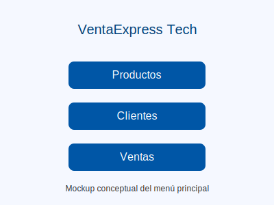
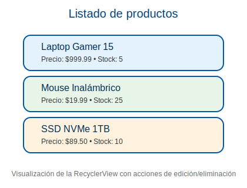
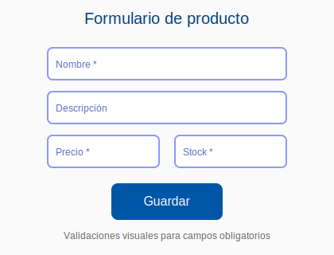
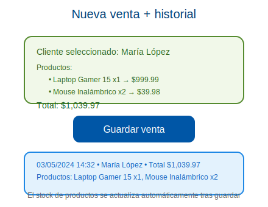
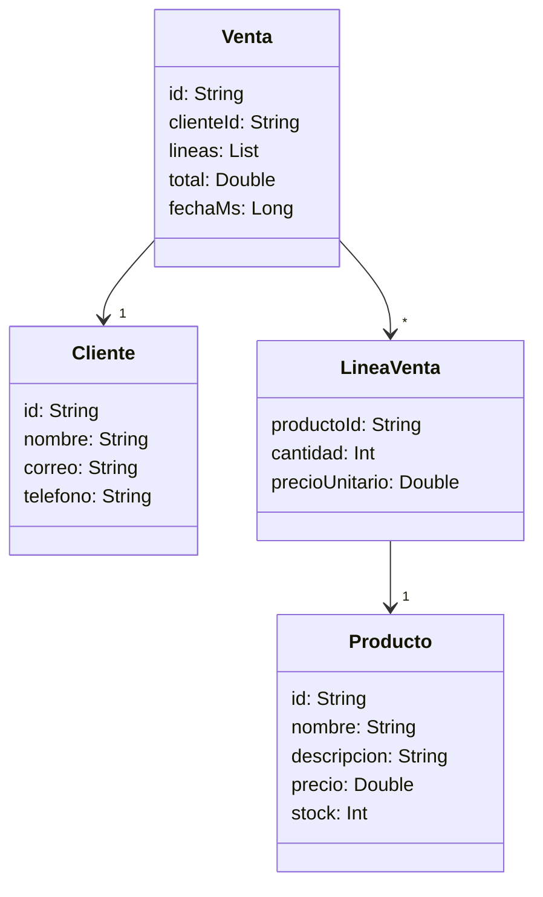

# VentaExpress Tech (versión sin backend)

Aplicación Android desarrollada en Kotlin que simula el flujo básico de ventas para una tienda de tecnología. Todo el comportamiento funciona de forma offline y persiste en almacenamiento local mediante `SharedPreferences` con serialización JSON (Gson). El objetivo es cubrir el ciclo completo: administrar productos y clientes, registrar ventas, validar reglas de negocio y consultar el historial.

## Características principales

- **Menú principal** con accesos a Productos, Clientes y Ventas.
- **Módulo de productos**: listado (RecyclerView), altas/ediciones con validaciones, eliminación protegida cuando existen ventas vinculadas.
- **Módulo de clientes**: listado, formularios con verificación de correo y teléfono, eliminación condicionada.
- **Ventas**: selección de cliente + productos (con control de stock), cálculo automático del total, persistencia del historial y actualización del inventario.
- **Datos seed** incluidos para arrancar con 3 productos y 2 clientes demostrativos.
- **Persistencia local**: toda la información queda guardada entre sesiones utilizando `SharedPreferences`.
- **Interfaz basada en Material Components** y reutilización de `strings.xml`, `colors.xml` y `dimens.xml`.

## Capturas conceptuales

> Las ilustraciones representan el flujo real de la app. Pueden utilizarse como guía para recrear las pantallas en un emulador o dispositivo físico.

- 
- 
- 
- 

## Arquitectura y tecnologías

- **Kotlin + ViewBinding** sobre una arquitectura **MVC ligera**.
- **DataRepository** como singleton responsable de cargar/persistir colecciones y aplicar reglas de negocio.
- **RecyclerView** para todas las listas (productos, clientes y ventas) con adaptadores dedicados.
- **Material Components** para botones, tarjetas y `TextInputLayout` con mensajes de error.
- **Gson** para serializar/deserializar los datos en `SharedPreferences`.

### Validaciones implementadas

- Productos: nombre obligatorio, precio mayor a 0 y stock ≥ 0.
- Clientes: nombre obligatorio, correo con formato válido (`Patterns.EMAIL_ADDRESS`) y teléfono con al menos 8 dígitos.
- Ventas: selección de cliente, al menos un producto con cantidad ≥ 1 y verificación de stock disponible antes de confirmar.

## Modelo de datos



## Flujo de usuario

```mermaid
flowchart TD
    A[Inicio de la app] --> B[Menú principal]
    B -->|Productos| C[Lista de productos]
    C --> C1[Agregar / Editar producto]
    C --> C2[Eliminar (si no tiene ventas asociadas)]
    B -->|Clientes| D[Lista de clientes]
    D --> D1[Agregar / Editar cliente]
    D --> D2[Eliminar (si no tiene ventas asociadas)]
    B -->|Ventas| E[Historial de ventas]
    E --> F[Registrar nueva venta]
    F --> F1[Seleccionar cliente]
    F --> F2[Agregar productos y cantidades]
    F --> F3[Validar stock y totales]
    F --> F4[Guardar venta y actualizar inventario]
    F4 --> E
```

## Estructura del proyecto

```
app/
├── build.gradle.kts
├── src/main
│   ├── AndroidManifest.xml
│   ├── java/com/example/ventaexpress
│   │   ├── data/… (modelos + repositorio)
│   │   ├── ui/products/…
│   │   ├── ui/clients/…
│   │   └── ui/sales/…
│   └── res/ (layouts, drawables, valores)
├── proguard-rules.pro
```

## Ejecución y pruebas

1. **Abrir el proyecto** en Android Studio Ladybug (2024.2.1 o superior).
2. **Sincronizar Gradle** para descargar dependencias.
3. Ejecutar la app en un emulador API 24+ o dispositivo real.
4. (Opcional) Desde la terminal: `./gradlew assembleDebug` para compilar o `./gradlew lint` para ejecutar verificaciones estáticas.

> La primera ejecución cargará los datos seed y, tras registrar ventas, el stock se verá actualizado automáticamente.

## Próximos pasos sugeridos

- Implementar filtrado/búsqueda en las listas.
- Internacionalizar textos y formateo de moneda según la configuración regional.
- Migrar la persistencia a Room si se requiere mayor robustez.
- Exportar el historial de ventas a CSV o TXT.
